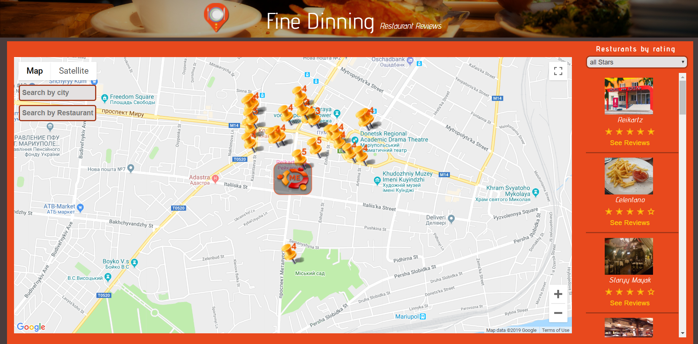

<h1>Restaurant review site</h1>
<h2>Technologies: HTML5, CSS3, Javascript, Google API.</h2>
<h3>Project requirements</h3>
<ol>
<li>A Google Maps map loaded with the Google Maps API.</li>
<li>A list of restaurants on the right side of the page that are within the area displayed on the map.</li>
<li>Add a review about an existing restaurant.</li>
<li>Add a restaurant by clicking on a specific place on the map.</li>
</ol>

